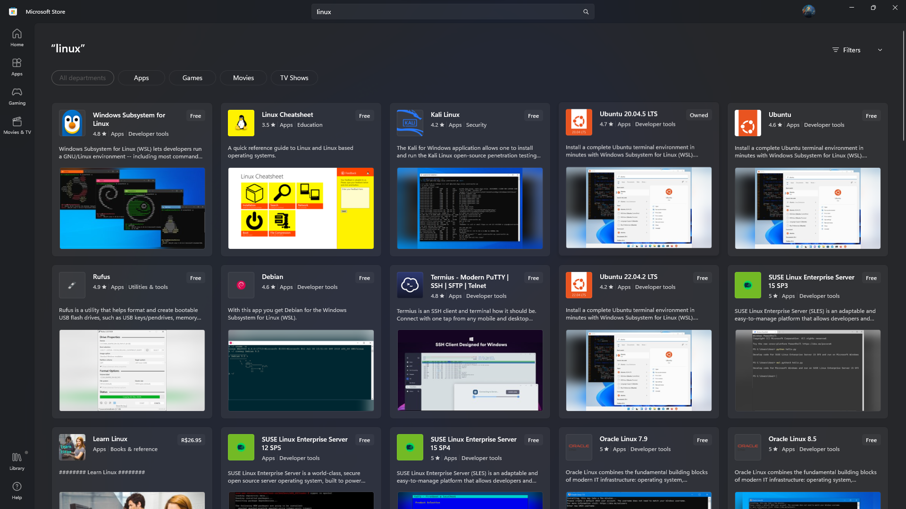

# Ambiente de Desenvolvimento Linux no macOS/Windows: WSL, Lima, Oh my ZSH + PowerLevel10k

Guia e tutorial para a utilização do Linux dentro do ambiente Windows/macOS com plugins e funcionalidades visando a melhor experiência para desenvolvimento.

## Sumário

- [Recomendações Iniciais](#recomendações-iniciais)
- [Escolha seu sistema](#escolha-seu-sistema)
  - [Usuários Windows](#usuários-windows)
    - [O que é WSL?](#o-que-é-wsl)
    - [Por que usar WSL 2 para desenvolvimento?](#por-que-usar-wsl-2-para-desenvolvimento)
    - [Instalação do WSL 2](#instalação-do-wsl-2)
  - [Usuários macOS](#usuários-macos)
    - [O que é Lima?](#o-que-é-lima)
    - [Instalação do Lima](#instalação-do-lima)
    - [Configuração do Lima](#configuração-do-lima)
- [O que é Z Shell?](#o-que-é-z-shell)
- [Instalando ZSH](#instalando-zsh)
- [O que é Oh My Zsh?](#o-que-é-oh-my-zsh)
- [Instalando Oh My Zsh](#instalando-ohmyzsh)
- [PowerLevel10k](#powerlevel10k)
- [ZSH Plugins](#zsh-plugins)
- [Adicionais](#adicionais)
- [Docker](#docker-wsl)
- [Visual Studio Code](#visual-studio-code)
- [Configurando fontes no Terminal/VSCode](#configurando-fontes-no-terminal-windows)

## Recomendações Iniciais

- [Instale uma fonte adequada](#fonte-ideal)
- [Cheque se sua máquina tem os requisitos mínimos](#requisitos-mínimos)

## Escolha seu sistema

Este guia contém instruções para configurar um ambiente de desenvolvimento Linux tanto para Windows (usando WSL2) quanto para macOS (usando Lima). Escolha a seção correspondente ao seu sistema operacional.

## Usuários Windows

### O que é WSL?

WSL significa "Windows Subsystem for Linux" é uma camada de compatibilidade dentro do sistema operacional Windows que permite a execução de aplicativos Linux diretamente no Windows, sem a necessidade de uma máquina virtual separada. Isso permite que os usuários executem aplicativos e ferramentas Linux em seus sistemas Windows sem ter que instalar um sistema operacional Linux separado.

No ano de 2019, a Microsoft divulgou uma nova edição do WSL, conhecida como WSL 2. Essa nova versão apresentou melhorias em relação à primeira:

- Capacidade de executar o kernel completo do Linux.
- Melhoria no desempenho de acesso aos arquivos internos do Linux.
- Compatibilidade completa com as chamadas de sistema.
  O lançamento oficial do WSL 2 ocorreu em 28 de maio de 2020.

Para entender as diferenças entre as versões, consulte o seguinte link: https://docs.microsoft.com/pt-br/windows/wsl/compare-versions

### Por que usar WSL 2 para desenvolvimento?

Existem várias razões pelas quais o WSL pode ser uma excelente escolha para desenvolvimento de software:

1. **Acesso a ferramentas Linux** - O WSL permite que os desenvolvedores acessem e usem as ferramentas de linha de comando do Linux, muitas das quais são amplamente utilizadas na comunidade de desenvolvimento de software, como o Git, Vim, GCC, entre outras. Isso pode ser útil para desenvolvedores que estão acostumados a trabalhar em ambientes Linux e querem continuar usando essas ferramentas no Windows.

2. **Suporte para ambientes de desenvolvimento populares do Linux** - O WSL suporta ambientes de desenvolvimento populares do Linux, como o Ruby on Rails, o Node.js e o Python. Isso significa que os desenvolvedores podem continuar usando esses ambientes de desenvolvimento populares sem ter que mudar para o Linux.

3. **Facilidade de configuração** - O WSL é fácil de configurar e usar, os desenvolvedores podem instalar rapidamente suas ferramentas de desenvolvimento favoritas, sem ter que passar por todo o processo de configuração de um ambiente Linux completo.

Em resumo, o WSL pode ser uma excelente escolha para desenvolvimento de software, permitindo que os desenvolvedores acessem ferramentas, suportem e configurem ambientes de desenvolvimento populares do Linux, e garantam a compatibilidade com o Windows.

### Instalação do WSL 2

> ## Windows 11
>
> Para instalar o WSL no Windows 11 ou Windows 10 na versão 2004 ou superior basta abrir um PowerShell ou um Prompt de comando e executar:

```bash
 wsl --install
```

Este comando irá instalar todas as dependências do WSL instalando o Ubuntu como o Linux padrão.

Se você quiser instalar uma distribuição diferente, execute o comando `wsl -l -o` , será listado todas as versões de Linux disponíveis. Instale a versão escolhida com o comando `wsl --install -d nome-da-distribuicao`.

Recomendamos manter-se com Ubuntu por ser uma distribuição popular e que já vem com diversas ferramentas pré-instaladas.

> ## Windows 10
>
> Caso você esteja em uma versão mais antiga do Windows 10, execute os seguintes comandos no PowerShell em modo administrador:

```bash
dism.exe /online /enable-feature /featurename:Microsoft-Windows-Subsystem-Linux /all /norestart
dism.exe /online /enable-feature /featurename:VirtualMachinePlatform /all /norestart
```

Abra o PowerShell e digite o comando `wsl`, se não funcionar reinicie sua máquina.

#### Definindo WSL 2 como sua versão padrão

Abra o Terminal/PowerShell e execute este comando:

```bash
wsl --set-default-version 2
```

**_⚠️ Caso mostre que você não tenha o Kernel_**<br>

Faça o download do Kernel 2 do WSL 2 nesse link: [https://docs.microsoft.com/pt-br/windows/wsl/wsl2-kernel](https://docs.microsoft.com/pt-br/windows/wsl/wsl2-kernel) e instale o pacote.

### Escolha sua distro pela Microsoft Store

Na Microsoft Store há diversas opções distribuições Linux para você baixar e utilizar.
<br><br>


Ao iniciar o Linux instalado, você deverá criar um nome de usuário, que pode ser o mesmo da sua máquina, e uma senha, este será o usuário root da sua instância WSL.

<hr>
Se tudo deu certo até aqui, parabéns, seu WSL2 já está funcionando! 🥳<br><br>

## Usuários macOS

### O que é Lima?

Lima é uma ferramenta que cria máquinas virtuais Linux no macOS com integração automática para sistemas de arquivos e portas. É uma alternativa para macOS que oferece uma experiência similar ao WSL2 do Windows, permitindo executar contêineres Docker e outros aplicativos Linux sem precisar instalar diretamente o Docker Desktop.

### Instalação do Lima

Para instalar o Lima no macOS, você precisa ter o Homebrew instalado. Se ainda não tiver, instale com:

```bash
/bin/bash -c "$(curl -fsSL https://raw.githubusercontent.com/Homebrew/install/HEAD/install.sh)"
```

Depois, instale o Lima com:

```bash
brew install lima
```

### Configuração do Lima

Após instalar o Lima, vamos configurá-lo para funcionar com uma instância Ubuntu:

1. Inicie o Lima pela primeira vez para criar o diretório de configuração:

```bash
limactl start --name=default
```

2. Interrompa a execução quando começar a baixar a imagem:

```bash
limactl stop default
```

3. Edite o arquivo de configuração para habilitar o modo writable:

```bash
nano ~/.lima/default/lima.yaml
```

4. Encontre a seção de mounts e modifique para incluir `writable: true`:

```yaml
mounts:
  - location: "~"
    writable: true
```

5. Salve o arquivo (CTRL+O, Enter, CTRL+X) e inicie o Lima novamente:

```bash
limactl start default
```

6. Configure seu arquivo `.zshrc` no macOS para facilitar a escolha entre macOS e Lima:

```bash
nano ~/.zshrc
```

7. Adicione (ou substitua seu arquivo existente) o conteúdo abaixo:

```bash
# Enable Powerlevel10k instant prompt. Deve ficar no topo!
if [[ -r "${XDG_CACHE_HOME:-$HOME/.cache}/p10k-instant-prompt-${(%):-%n}.zsh" ]]; then
  source "${XDG_CACHE_HOME:-$HOME/.cache}/p10k-instant-prompt-${(%):-%n}.zsh"
fi

# Caminho do Oh My Zsh
export ZSH="$HOME/.oh-my-zsh"

# Plugins que você quer usar
plugins=(git zsh-autosuggestions zsh-syntax-highlighting)

# Tema Powerlevel10k
ZSH_THEME="powerlevel10k/powerlevel10k"

# Carrega o Oh My Zsh (necessário para plugins funcionarem!)
source $ZSH/oh-my-zsh.sh

# Configuração visual do prompt (se existir)
[[ -f ~/.p10k.zsh ]] && source ~/.p10k.zsh

if [[ $- == *i* ]]; then
  GREEN='\033[0;32m'
  BLUE='\033[1;34m'
  YELLOW='\033[1;33m'
  RED='\033[0;31m'
  NC='\033[0m' # No Color
  
  echo ""
  echo -e "${BLUE}==============================="
  echo -e "${YELLOW} Qual ambiente deseja iniciar? "
  echo -e "${BLUE}===============================${NC}"
  echo -e "${GREEN}[1]${NC} macOS (shell padrão)"
  echo -e "${GREEN}[2]${NC} Ubuntu (Lima VM)"
  echo -e "${BLUE}===============================${NC}"
  echo -ne "${YELLOW}Escolha [1-2]: ${NC}"
  read env_choice
  
  case "$env_choice" in
    1)
      echo -e "${GREEN}👉 Você está no shell do macOS.${NC}" ;;
    2)
      echo -e "${GREEN}👉 Iniciando shell Ubuntu via Lima...${NC}"
      exec lima ;;
    *)
      echo -e "${RED}❌ Opção inválida. Continuando no macOS...${NC}" ;;
  esac
fi
```

8. Salve o arquivo e recarregue-o:

```bash
source ~/.zshrc
```

Agora, toda vez que você abrir um novo terminal, terá a opção de escolher entre o shell do macOS ou o Ubuntu via Lima.

## O que é Z Shell?

Z Shell, também conhecido como zsh, é um interpretador de comandos de shell para sistemas Unix-like, como Linux e macOS. Ele é uma alternativa mais poderosa e avançada ao shell padrão Bash.

O Z Shell tem muitos recursos úteis, incluindo autocompletar, histórico de comandos aprimorado, substituição de nomes de arquivos com wildcards (expressões regulares), suporte a várias abas e janelas, personalização da aparência e do comportamento do shell e muito mais. Além disso, ele tem um sistema de plugin robusto que permite estender ainda mais suas funcionalidades.

Outro recurso útil do Z Shell é o seu "prompt de diretório", que mostra o diretório atual em que o usuário está trabalhando no shell, bem como outras informações relevantes. Isso pode ajudar a evitar erros ao executar comandos em diretórios errados e a tornar o trabalho no shell mais eficiente.

O Z Shell pode ser instalado em muitas distribuições Linux e macOS por meio de gerenciadores de pacotes ou por meio de download direto do site oficial. Ele é frequentemente recomendado para usuários avançados de linha de comando que desejam uma experiência de shell mais poderosa e personalizável.

### _Por que utilizar o ZSH vai melhorar a sua experiência utilizando o terminal?_

- **Personalização**: o Z Shell é altamente personalizável e você pode ajustar muitas configurações para adaptar o shell às suas preferências. Isso pode incluir personalizar o prompt, criar aliases para comandos frequentemente usados, configurar atalhos de teclado personalizados e muito mais. Neste guia irei mostrar o **PowerLevel10k** um plugin versátil, extremamente útil que deixará está funcionalidade de customização visual super simples de ser feita e que possivelmente irá cobrir a maioria das suas necessidades.

- **Compatibilidade com Bash**: o Z Shell é compatível com a maioria dos comandos do Bash, o que significa que você pode usar scripts e comandos existentes sem precisar reescrevê-los. Além disso, o Z Shell tem recursos adicionais que o Bash não possui, portanto, você pode aproveitar o melhor dos dois mundos.

## Instalando ZSH

### No WSL (Windows)

Para instalar o Z Shell abra o app Terminal do Windows para acessar o seu WSL <br><br>


No terminal, em ambiente Linux, atualize os seus pacotes e dê upgrade nos programas do seu sistema utilizando os comandos abaixo:

```bash
sudo apt update && sudo apt upgrade
```

**Ubuntu, Debian & derivatives (Windows 10 WSL | Native Linux kernel with Windows 10 build 1903)** <br>
Para instalar o zshell utilize:

```bash
sudo apt install zsh -y
```

### No Lima (macOS)

O ZSH já vem instalado por padrão no macOS. Para instalar no ambiente Lima:

```bash
lima
sudo apt update && sudo apt upgrade
sudo apt install zsh -y
```

Para checar se o zsh foi devidamente instalado, reinicie seu terminal e digite, `zsh --version` , o comando deve retornar algo similar à: `zsh 5.8.1`

## O que é Oh My Zsh?

Oh My Zsh é um framework de código aberto para gerenciar sua configuração do Z Shell (zsh). Ele fornece uma maneira fácil de instalar e gerenciar temas, plugins e outras configurações do Z Shell. Com o Oh My Zsh, você pode personalizar facilmente a aparência e o comportamento do seu shell, adicionar novas funcionalidades e tornar sua experiência de linha de comando mais produtiva e agradável.

O Oh My Zsh vem com vários recursos úteis pré-instalados, como autocompletar, sugestões de comandos, substituição de nomes de arquivos com wildcards, temas de aparência atraente e muito mais. Além disso, existem centenas de plugins disponíveis para o Oh My Zsh, que podem ser facilmente adicionados e configurados para atender às suas necessidades.

Vamos utilizar o Oh My Zsh para instalar o PowerLevel10k, um plugin que vai deixar nosso terminal charmoso e intuitivo, mostrando diretorios e status do Git utilizando ícones e horários diretamente nas linhas de escrita do prompt.

## Oh My Zsh

> ### Pré-requisitos:

- Ter Git instalado (Por padrão o **WSL/Lima - Ubuntu** já vem com o Git instalado, mas caso queira se certificar digite `git --version` no seu terminal).

- Ter `curl` ou `wget` instalados (Neste guia iremos utilizar curl).

⚠️ **_Caso o Git não esteja instalado no seu ambiente, utilize:_**

```bash
sudo apt update && sudo apt upgrade
sudo apt install git
```

## CURL

Vamos utilizar o curl, uma ferramenta de linha de comando que permite realizar transferência de dados de e para servidores por meio de vários protocolos de rede, incluindo HTTP, HTTPS, FTP, SMTP, POP3 e muitos outros, para baixar e instalar o Oh My ZSH.
<br><br>
Para instalar o curl basta somente fazer os mesmos passos feitos utilizados para a instalação do zsh:

```bash
sudo apt install curl
```

Para checar se foi devidamente instalado execute o comando: `curl --version`

## Instalando OhMyZsh

Para instalar Oh My Zsh basta digitar este comando no terminal e reinciar a janela do seu ambiente Linux.

```bash
sh -c "$(curl -fsSL https://raw.githubusercontent.com/ohmyzsh/ohmyzsh/master/tools/install.sh)" -y
```

## PowerLevel10k

Antes de prosseguir com a instalação é **ideal**:

- Fontes ideias:
  - [MesloLGS NF Regular](
    https://github.com/romkatv/powerlevel10k-media/raw/master/MesloLGS%20NF%20Regular.ttf)
  - [MesloLGS NF Bold](
    https://github.com/romkatv/powerlevel10k-media/raw/master/MesloLGS%20NF%20Bold.ttf)
  - [MesloLGS NF Italic](
    https://github.com/romkatv/powerlevel10k-media/raw/master/MesloLGS%20NF%20Italic.ttf)
  - [MesloLGS NF Bold Italic](
    https://github.com/romkatv/powerlevel10k-media/raw/master/MesloLGS%20NF%20Bold%20Italic.ttf)

- Outras [fontes adequadas](#fonte-ideal).
- Fazer todos os passos anteriores a este.

### O que o PowerLevel10k faz?

É um tema para o ZSH, que enfatiza velocidade, flexibilidade e uma experiência fora da caixa, voltada principalmente para a customização do seu terminal.

## Instalando o PowerLevel10k

A maneira mais simples de instalar é utilizando o git, desta forma bastar executar o código no terminal e reiniciar a janela para entrar no modo de configuração.

```bash
git clone --depth=1 https://github.com/romkatv/powerlevel10k.git ~/powerlevel10k
echo 'source ~/powerlevel10k/powerlevel10k.zsh-theme' >>~/.zshrc
```

## Wizard e Customização

Após reiniciar a janela, um wizard deve aparecer no seu terminal para selecionar opções de customização estéticas, a partir daqui vai de seu bom gosto e preferência, caso queira repetir o processo de setup utilize:

```bash
p10k configure
```


## ZSH Plugins

Agora que seu combo setup está pronto, WSL2/Lima + zsh + powerlevel10k, podemos colocar a valer as ferramentas a nossa disposição. Aqui vou somente mostrar como instalar dois plugins que são em minha opnião indispensáveis, mas vale ressaltar que as opções de customização são praticamente ilimitadas e que você pode adicionar quantos plugins desejar.
<br><br>

> ### zsh-syntax-highlighting & zsh-autosuggestions

Execute os dois comandos abaixo para instalar o zsh-autosuggestions e o zsh-syntax-highlighting, respectivamente.

```bash
git clone https://github.com/zsh-users/zsh-autosuggestions.git $ZSH_CUSTOM/plugins/zsh-autosuggestions
```

```bash
git clone https://github.com/zsh-users/zsh-syntax-highlighting.git $ZSH_CUSTOM/plugins/zsh-syntax-highlighting
```

Depois de instalados, vá para `nano ~/.zshrc` e ache `plugins=(git)` e adicione os plugins desta forma:

```bash
plugins=(git zsh-autosuggestions zsh-syntax-highlighting)
```

- Reabra o terminal ou digite `source .zshrc` e pronto. 🥳

## Adicionais

Já que você está dentro de um ambiente Linux, recomendamos que você instale algumas ferramentas que vão ser úteis de maneira geral, tanto para a área de desenvolvimento, como a utilização do terminal em si.

1. **neofetch**
2. **tree**
3. **nvm**
4. **npm**
5. **vim**
6. **nnn**
7. **pip**
8. **bat**
9. **fd**
10. **zoxide**

## Docker wsl

### Docker no WSL (Windows)

### Verifique o grupo Docker:

- Primeiro, verifique se o seu usuário faz parte do grupo Docker. Execute o seguinte comando:

````bash
groups
````


- Verifique se o grupo ``docker`` está listado. Se <span style="color: red;">**não estiver**</span>, você pode adicioná-lo novamente com:

````bash
sudo usermod -aG docker $USER
````
- Certifique-se de que não haja erros de digitação e de que você fez logout e login novamente após a alteração.

### Reinicie o Docker:

- Certifique-se de reiniciar o serviço do Docker após adicionar-se ao grupo Docker. Execute o seguinte comando:

````bash
sudo systemctl restart docker
````

#### Verifique as permissões do socket Docker:

- Certifique-se de que o socket do Docker (/var/run/docker.sock) tenha permissões adequadas para o grupo "docker". Você pode verificar isso com o seguinte comando:

````bash
ls -l /var/run/docker.sock
````

Deve exibir algo como:

````arduino
srw-rw---- 1 root docker 0 Sep 18 10:00 /var/run/docker.sock
````

- Se as permissões não estiverem definidas corretamente, você pode corrigi-las com:

````bash
sudo chown $USER:docker /var/run/docker.sock
````

### Reinicie seu WSL:

- Às vezes, pode ser necessário reiniciar o WSL para que as alterações nas permissões tenham efeito.

### Docker no Lima (macOS)

O Lima já vem com Docker pré-configurado. Ao acessar o ambiente Lima (executando `lima`), você já pode usar os comandos Docker normalmente:

```bash
lima
docker run hello-world
```

- Após realizar essas etapas, tente o comando docker.

````dockerfile
docker run docker/whalesay cowsay hello_world
````


## Visual Studio Code

Uma das grandes vantagens de se utilizar o WSL2/Lima é a interatividade com o VSCode, desta forma, é possível usar a IDE para manipular os arquivos e diretórios dentro do Linux, além de usar o terminal para gerenciar pacotes e ver status do git dos seus projetos em tempo real de desenvolvimento.

### Pré-requisitos

- Já ter instalado o [VSCode](https://code.visualstudio.com/download) na sua máquina
- Instalar a extensão WSL no Visual Studio Code (para Windows)
- Instalar a extensão Remote-SSH (para macOS)


## Utilização

### No WSL (Windows)
Após ter instalado o VSCode e a extensão WSL, dentro do terminal basta executar:

```bash
code nome-do-arquivo
```

O Ubuntu irá abrir o diretório/arquivo no VSCode em ambiente Linux. Caso tudo corra de maneira correta, no canto inferior esquerdo você verá uma tag em azul com o nome similar à: `WSL: Ubuntu` e o seu terminal integrado no VSCode funcional em Linux.

### No Lima (macOS)
Após instalar o VSCode e a extensão Remote-SSH:

1. Adicione um host para o Lima no VSCode:
   - Abra a paleta de comandos (CMD+Shift+P)
   - Digite "Remote-SSH: Add New SSH Host"
   - Digite `lima` e pressione Enter
   - Selecione o arquivo de configuração SSH

2. Conecte-se ao host Lima:
   - Abra a paleta de comandos (CMD+Shift+P)
   - Digite "Remote-SSH: Connect to Host"
   - Selecione "lima"

3. Você pode agora abrir pastas e arquivos do ambiente Lima diretamente no VSCode.


## Fonte ideal

Para usar de todas as funcionalidades da melhor maneira é necessário instalar uma fonte que possua ligaduras e ícones. Neste caso, as melhores fontes a serem utilizadas são as [Nerd Fonts](https://www.nerdfonts.com/font-downloads), para usar elas entre no site deles, escolha uma fonte e instale em sua máquina.

## Configurando fontes no Terminal Windows

A configuração dentro do terminal Windows é feita a partir dos perfis, desta forma, abra a configurações pressionando `Ctrl + ,` ou clicando na setinha ao lado da aba para selecionar a opção. No perfil `Ubuntu` procure no menu a opção de `Aparência`, dentro dele, procure pela opção de fontes e altere para a que você baixou.


## Configurando fontes no Terminal macOS

Para configurar fontes no Terminal do macOS:

1. Abra o Terminal
2. Vá para Preferências (Cmd + ,)
3. Clique na aba "Perfis"
4. Selecione seu perfil ativo
5. Clique em "Texto"
6. Altere a fonte para a Nerd Font que você instalou

## Configurando fonte no VSCode

Se seu terminal e WSL/Lima estão funcionando mas você não está conseguindo visualizar os ícones dentro do terminal integrado do VSCode, basta somente uma simples configuração nas configurações de usuário para solucionar isso.

Dentro do VSCode, abra a palheta de comando, `ctrl + shift + p` (Windows) ou `cmd + shift + p` (macOS), e procure por `Preferences: Open User Settings (JSON)` ou `Preferências: Abrir as Configurações do Usuário (JSON)` caso use o VSCode em português.

Nas linhas do editor você verá uma estrutura de `JSON`, basta adicionar uma nova linha e digitar:

```bash
  "terminal.integrated.fontFamily": "nome-da-fonte",
```

⚠️ **Lembre-se de digitar o exato nome da fonte para que funcione corretamente**

- Para checar as fontes instaladas no seu computador:
  - Windows: pesquisar na barra de pesquisa o termo `Fontes` ou abrir o Painel de Controle e selecionar o icone `Fontes`.
  - macOS: abrir o aplicativo Font Book.

⚠️ **O Terminal do VSCode só possui suporte com fontes mono**

## Requisitos Mínimos

### Para WSL2 (Windows)

Para executar o WSL2 (Windows Subsystem for Linux 2) em um sistema operacional Windows 10, você precisa cumprir os seguintes requisitos mínimos de sistema:

- Windows 10, versão 1903 ou superior - Certifique-se de que seu sistema operacional Windows 10 esteja atualizado para a versão 1903 ou superior. Para verificar a versão do seu Windows, pressione a tecla Windows + R, digite "winver" e pressione Enter.

- Processador de 64 bits com suporte para virtualização - O WSL2 requer um processador de 64 bits com suporte para virtualização de hardware. Verifique se a virtualização está habilitada no BIOS do seu computador.

- Pelo menos 4 GB de RAM - É recomendável ter pelo menos 4 GB de RAM para executar o WSL2.

- 5 GB de espaço livre em disco - O WSL2 requer pelo menos 5 GB de espaço livre em disco para ser instalado.

### Para Lima (macOS)

Para executar o Lima no macOS, você precisa:

- macOS 11 (Big Sur) ou superior
- Processador Intel ou Apple Silicon (M1/M2)
- Pelo menos 4 GB de RAM
- 5 GB de espaço livre em disco
- Homebrew instalado

## Referências

- [Guia rápido do WSL2 + Docker](https://github.com/codeedu/wsl2-docker-quickstart)
- [WSL - Wikipedia](https://en.wikipedia.org/wiki/Windows_Subsystem_for_Linux#:~:text=WSL%202%20requires%20Windows%2011,of%20native%20Ubuntu%2020.04%20LTS.)
- [Lima - GitHub](https://github.com/lima-vm/lima)
- [Z shell](https://en.wikipedia.org/wiki/Z_shell)
- [Oh My Zsh](https://github.com/ohmyzsh/ohmyzsh)
- [Powerlevel10k](https://github.com/romkatv/powerlevel10k)
- [Gist - Plugins zsh](https://gist.github.com/dogrocker/1efb8fd9427779c827058f873b94df95)
- [Visual Studio Code](https://code.visualstudio.com/)
- [Nerd Fonts](https://www.nerdfonts.com/font-downloads)